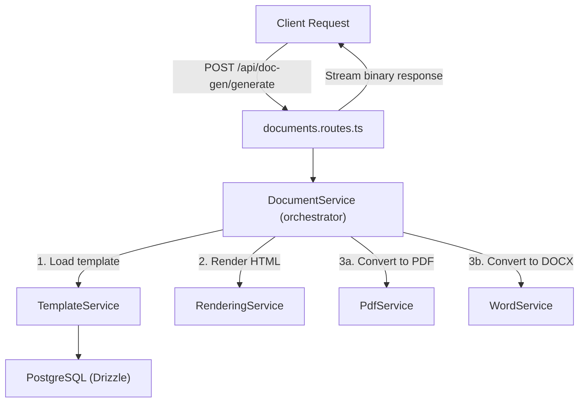
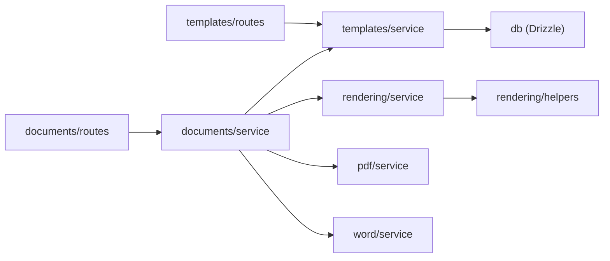

# Modular Document Generation System

## Current State

The project is an Express + React inventory management app using Drizzle ORM with PostgreSQL. Existing patterns:
- Routes split into `server/routes/<feature>-routes.ts` modules with `registerXxxRoutes(app)` exports
- Single `DatabaseStorage` class in [server/storage.ts](server/storage.ts) for most DB access
- Schema tables and types in [shared/schema.ts](shared/schema.ts) using `pgTable` + `drizzle-zod`
- Route path constants defined in [shared/routes.ts](shared/routes.ts)
- Existing PDF uses imperative PDFKit drawing ([server/render-executive-summary-pdf.ts](server/render-executive-summary-pdf.ts)) -- no template engine

## Architecture

The new system introduces a `server/doc-gen/` namespace with **5 feature modules**, each with a single responsibility. This avoids polluting the existing flat `server/` layout while keeping feature cohesion.



## Folder Structure

```
server/doc-gen/
  index.ts                         # barrel: registerDocGenRoutes(app)
  types.ts                         # shared interfaces across all modules

  templates/
    templates.schema.ts            # Drizzle pgTable + Zod insert schema
    templates.service.ts           # CRUD: create, getById, list, update, delete
    templates.routes.ts            # GET/POST/PUT/DELETE /api/doc-gen/templates

  rendering/
    rendering.service.ts           # Handlebars compile + render(template, data) -> HTML
    rendering.helpers.ts           # Custom Handlebars helpers (fotos, formatDate, etc.)

  pdf/
    pdf.service.ts                 # HTML -> PDF Buffer via Puppeteer

  word/
    word.service.ts                # HTML -> DOCX Buffer via html-to-docx

  documents/
    documents.service.ts           # Orchestrator: resolveData + render + convert
    documents.routes.ts            # POST /api/doc-gen/generate, GET /api/doc-gen/preview
```

Migration file: `migrations/add-doc-templates.sql`

## New Dependencies

- **handlebars** -- template engine matching `{{variable}}` syntax exactly
- **puppeteer** -- HTML-to-PDF (user-specified requirement)
- **html-to-docx** -- HTML-to-DOCX conversion

## Module Details

### 1. Templates Module (`server/doc-gen/templates/`)

**Schema** (`templates.schema.ts`) -- new table in [shared/schema.ts](shared/schema.ts):

```typescript
export const docTemplates = pgTable("doc_templates", {
  id: serial("id").primaryKey(),
  slug: text("slug").notNull().unique(),
  name: text("name").notNull(),
  description: text("description"),
  bodyHtml: text("body_html").notNull(),       // Handlebars HTML template
  headerHtml: text("header_html"),
  footerHtml: text("footer_html"),
  cssStyles: text("css_styles"),                // custom CSS per template
  variables: jsonb("variables").notNull().$type<TemplateVariable[]>(),
  pageConfig: jsonb("page_config").$type<PageConfig>(),
  category: text("category"),                   // "acta_entrega", "inventario", etc.
  version: integer("version").notNull().default(1),
  active: boolean("active").notNull().default(true),
  createdByUserId: integer("created_by_user_id").references(() => users.id, { onDelete: "set null" }),
  createdAt: timestamp("created_at", { withTimezone: true }).notNull().defaultNow(),
  updatedAt: timestamp("updated_at", { withTimezone: true }).notNull().defaultNow(),
});
```

Where `TemplateVariable` is:
```typescript
interface TemplateVariable {
  key: string;           // "nombre", "objeto", "serie"
  label: string;         // "Nombre del empleado"
  type: "text" | "date" | "number" | "image" | "list";
  required: boolean;
  defaultValue?: string;
}
```

**Service** -- pure DB operations using `db` directly (follows pattern of files that bypass `storage` for domain-specific features):
- `create(input)` / `getById(id)` / `getBySlug(slug)` / `list(filters)` / `update(id, patch)` / `softDelete(id)`

**Routes** -- CRUD at `/api/doc-gen/templates`, protected by `requireAuth` + `requireRole("editor", "admin")`.

### 2. Rendering Module (`server/doc-gen/rendering/`)

**Service** -- stateless, no DB dependency:
- `render(templateHtml: string, data: Record<string, unknown>): string` -- compiles Handlebars template, applies data, returns HTML string
- `renderFull(template: DocTemplate, data: Record<string, unknown>): string` -- assembles header + body + footer with CSS into a complete HTML document
- `extractVariables(templateHtml: string): string[]` -- parse `{{...}}` tokens for editor/preview tooling
- `validateData(variables: TemplateVariable[], data: Record<string, unknown>): ValidationResult` -- checks required fields before rendering

**Helpers** (`rendering.helpers.ts`):
- `{{formatDate fecha "DD/MM/YYYY"}}` -- date formatting
- `{{#fotos images}}` -- block helper that renders an image grid
- `{{currency amount}}` -- formatted number
- `{{#ifEquals a b}}` -- conditional

### 3. PDF Module (`server/doc-gen/pdf/`)

**Service** -- manages a shared Puppeteer browser instance:
- `htmlToPdf(html: string, options?: PdfOptions): Promise<Buffer>` -- launches page, sets content, generates PDF
- `initialize()` / `shutdown()` -- lifecycle for the browser instance (called from server startup/shutdown)

`PdfOptions` includes: `format`, `landscape`, `margins`, `headerTemplate`, `footerTemplate`, `printBackground`.

A singleton pattern with lazy initialization keeps Puppeteer warm across requests:
```typescript
let browser: Browser | null = null;

async function getBrowser(): Promise<Browser> {
  if (!browser) {
    browser = await puppeteer.launch({ headless: true, args: ["--no-sandbox"] });
  }
  return browser;
}
```

### 4. Word Module (`server/doc-gen/word/`)

**Service** -- stateless converter:
- `htmlToDocx(html: string, options?: DocxOptions): Promise<Buffer>` -- converts complete HTML to DOCX buffer

Uses `html-to-docx` which accepts full HTML documents and produces valid `.docx` files.

### 5. Documents Module -- Orchestrator (`server/doc-gen/documents/`)

**Service** -- the only module that imports from other modules:
```typescript
async function generateDocument(request: GenerateDocumentRequest): Promise<GeneratedDocument> {
  // 1. Load template
  const template = await templateService.getById(request.templateId);

  // 2. Validate data against template variables
  const validation = renderingService.validateData(template.variables, request.data);
  if (!validation.valid) throw new ValidationError(validation.errors);

  // 3. Render HTML
  const html = renderingService.renderFull(template, request.data);

  // 4. Convert to target format
  switch (request.format) {
    case "pdf":
      return { buffer: await pdfService.htmlToPdf(html, template.pageConfig), mimeType: "application/pdf", extension: "pdf" };
    case "docx":
      return { buffer: await wordService.htmlToDocx(html), mimeType: "application/vnd.openxmlformats-officedocument.wordprocessingml.document", extension: "docx" };
    case "html":
      return { buffer: Buffer.from(html, "utf-8"), mimeType: "text/html", extension: "html" };
  }
}
```

**Routes**:
- `POST /api/doc-gen/generate` -- body: `{ templateId, data, format }` -- returns binary file
- `POST /api/doc-gen/preview` -- body: `{ templateId, data }` -- returns rendered HTML string for live preview
- `GET /api/doc-gen/templates/:id/variables` -- returns variable metadata for form builders

### Shared Types (`server/doc-gen/types.ts`)

```typescript
export interface GenerateDocumentRequest {
  templateId: number;
  data: Record<string, unknown>;
  format: "pdf" | "docx" | "html";
  filename?: string;
}

export interface GeneratedDocument {
  buffer: Buffer;
  mimeType: string;
  extension: string;
}

export interface PdfOptions {
  format?: "A4" | "Letter";
  landscape?: boolean;
  margins?: { top: string; right: string; bottom: string; left: string };
  printBackground?: boolean;
}

export interface PageConfig extends PdfOptions {
  headerHtml?: string;
  footerHtml?: string;
}

export interface TemplateVariable {
  key: string;
  label: string;
  type: "text" | "date" | "number" | "image" | "list";
  required: boolean;
  defaultValue?: string;
}
```

## Integration Points

**Registration** -- in [server/routes.ts](server/routes.ts), add one line following the existing pattern:
```typescript
import { registerDocGenRoutes } from "./doc-gen";
// ...inside registerRoutes():
registerDocGenRoutes(app);
```

**Schema** -- the `docTemplates` table definition goes into [shared/schema.ts](shared/schema.ts) at the end, following the exact same `pgTable` + exported type pattern used by every other table.

**Migration** -- a new `migrations/add-doc-templates.sql` file with `CREATE TABLE IF NOT EXISTS doc_templates (...)`.

## Dependency Flow (no circular imports)



No module imports from `documents/`. The orchestrator is the only convergence point.

## Extensibility for Future Requirements

- **Multiple document types** -- add a `category` field to templates; the orchestrator is format-agnostic
- **Template editor** -- `extractVariables()` + the `variables` JSON column provide metadata for a React form builder
- **Real-time preview** -- the `/api/doc-gen/preview` endpoint returns raw HTML; the client renders it in an iframe
- **New output formats** -- add a new module under `server/doc-gen/<format>/` and a case in the orchestrator switch
